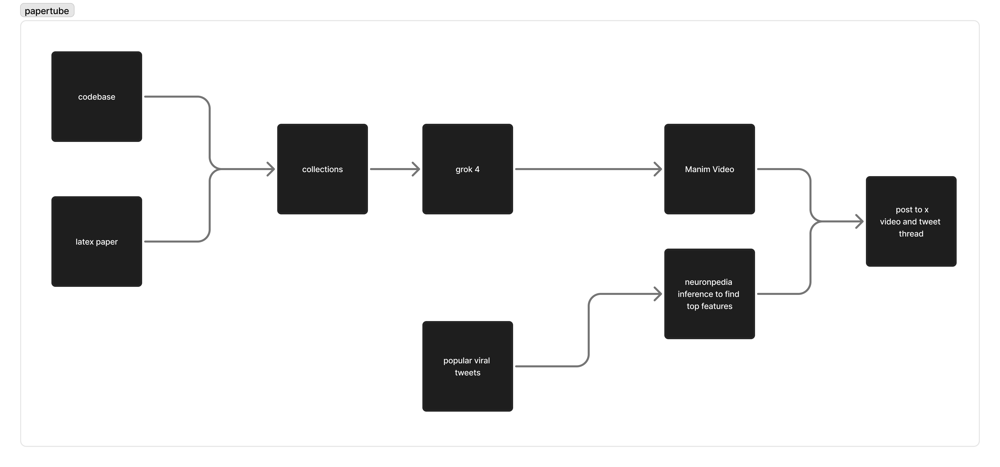

## Ideas

Tracks: Grokipedia

Platform for creating educational manim vids from research papers
-Upload papers and code to collections
-chunk it
-use similarity search/SAEs to link code and paper chunks
-feed it to grok 4.1 to generate manim code
-post to grokipedia

